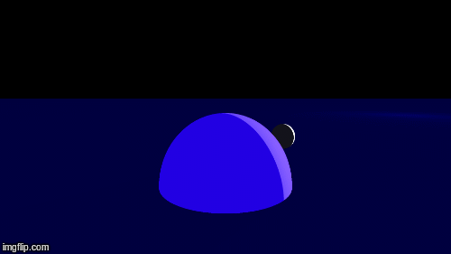
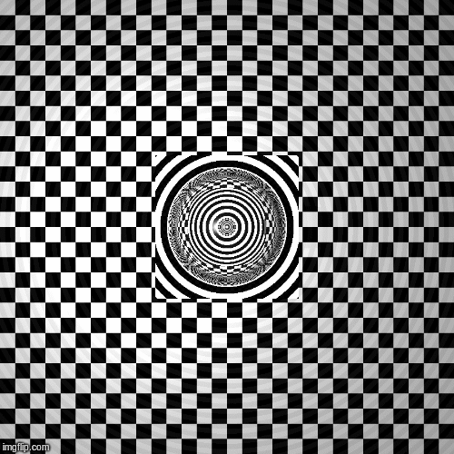

# RTC-RayTracer

A simple ray tracer

Gif of images created by the raytracer:

~~The shapes could use some refactoring.~~
I went with the following refactor: the different kinds of Shapes are wholly defined at the value level. A shape kind now is a pair of functions that are called back into to determine surface-normals and intersections. For now I replaced all the normal references in the methods with `Arc`s because they're easier to handle.
